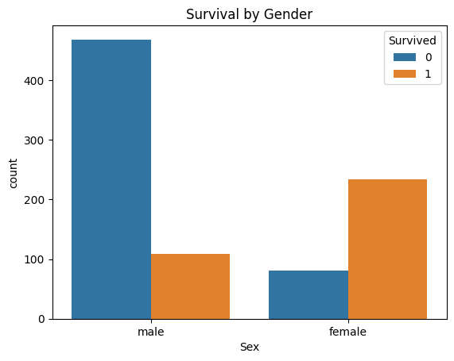
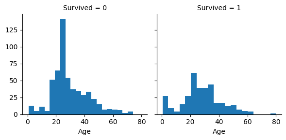

```python
import pandas as pd
import numpy as np
import matplotlib.pyplot as plt
import seaborn as sns
from sklearn.model_selection import train_test_split
from sklearn.preprocessing import StandardScaler
from sklearn.preprocessing import OneHotEncoder
from sklearn.linear_model import LogisticRegression
from sklearn.metrics import accuracy_score
from sklearn import metrics
from sklearn.impute import SimpleImputer
```


```python
train_df = pd.read_csv('train.csv')
test_df = pd.read_csv('test.csv')
```


```python
train_df.head()
```


<div>
<style scoped>
    .dataframe tbody tr th:only-of-type {
        vertical-align: middle;
    }

    .dataframe tbody tr th {
        vertical-align: top;
    }

    .dataframe thead th {
        text-align: right;
    }
</style>
<table border="1" class="dataframe">
  <thead>
    <tr style="text-align: right;">
      <th></th>
      <th>PassengerId</th>
      <th>Survived</th>
      <th>Pclass</th>
      <th>Name</th>
      <th>Sex</th>
      <th>Age</th>
      <th>SibSp</th>
      <th>Parch</th>
      <th>Ticket</th>
      <th>Fare</th>
      <th>Cabin</th>
      <th>Embarked</th>
    </tr>
  </thead>
  <tbody>
    <tr>
      <th>0</th>
      <td>1</td>
      <td>0</td>
      <td>3</td>
      <td>Braund, Mr. Owen Harris</td>
      <td>male</td>
      <td>22.0</td>
      <td>1</td>
      <td>0</td>
      <td>A/5 21171</td>
      <td>7.2500</td>
      <td>NaN</td>
      <td>S</td>
    </tr>
    <tr>
      <th>1</th>
      <td>2</td>
      <td>1</td>
      <td>1</td>
      <td>Cumings, Mrs. John Bradley (Florence Briggs Th...</td>
      <td>female</td>
      <td>38.0</td>
      <td>1</td>
      <td>0</td>
      <td>PC 17599</td>
      <td>71.2833</td>
      <td>C85</td>
      <td>C</td>
    </tr>
    <tr>
      <th>2</th>
      <td>3</td>
      <td>1</td>
      <td>3</td>
      <td>Heikkinen, Miss. Laina</td>
      <td>female</td>
      <td>26.0</td>
      <td>0</td>
      <td>0</td>
      <td>STON/O2. 3101282</td>
      <td>7.9250</td>
      <td>NaN</td>
      <td>S</td>
    </tr>
    <tr>
      <th>3</th>
      <td>4</td>
      <td>1</td>
      <td>1</td>
      <td>Futrelle, Mrs. Jacques Heath (Lily May Peel)</td>
      <td>female</td>
      <td>35.0</td>
      <td>1</td>
      <td>0</td>
      <td>113803</td>
      <td>53.1000</td>
      <td>C123</td>
      <td>S</td>
    </tr>
    <tr>
      <th>4</th>
      <td>5</td>
      <td>0</td>
      <td>3</td>
      <td>Allen, Mr. William Henry</td>
      <td>male</td>
      <td>35.0</td>
      <td>0</td>
      <td>0</td>
      <td>373450</td>
      <td>8.0500</td>
      <td>NaN</td>
      <td>S</td>
    </tr>
  </tbody>
</table>
</div>


## Data Preprocessing
- get rid of nulls
- encoding categorical data


```python
train_df.isna().any()
```


    PassengerId    False
    Survived       False
    Pclass         False
    Name           False
    Sex            False
    Age             True
    SibSp          False
    Parch          False
    Ticket         False
    Fare           False
    Cabin           True
    Embarked        True
    dtype: bool


```python
# any one without a cabin just place None
train_df['Cabin'] = train_df['Cabin'].apply(lambda x: 'None' if pd.isna(x) else x)
test_df['Cabin'] = test_df['Cabin'].apply(lambda x: 'None' if pd.isna(x) else x)
```


```python
train_df.isna().any()
```


    PassengerId    False
    Survived       False
    Pclass         False
    Name           False
    Sex            False
    Age             True
    SibSp          False
    Parch          False
    Ticket         False
    Fare           False
    Cabin          False
    Embarked        True
    dtype: bool


```python
# find the most common location embarked
train_df['Embarked'] = train_df['Embarked'].fillna(train_df['Embarked'].mode()[0])
test_df['Embarked'] = test_df['Embarked'].fillna(test_df['Embarked'].mode()[0])
```


```python
train_df.isna().any()
```


    PassengerId    False
    Survived       False
    Pclass         False
    Name           False
    Sex            False
    Age             True
    SibSp          False
    Parch          False
    Ticket         False
    Fare           False
    Cabin          False
    Embarked       False
    dtype: bool


```python
# Age is usually correlated with the amount of money they make and sex. 
# find the average age based on sex and passenger class (1st 2nd or 3rd)
corr_df = train_df.groupby(['Pclass', 'Sex']).Age.mean().reset_index()

def update_age(params):
    pclass = params.iloc[0]
    sex = params.iloc[1]
    age = params.iloc[2]
    if pd.isnull(age):
        age = float(corr_df[(corr_df['Pclass'] == pclass) & (corr_df['Sex'] == sex)]['Age'].iloc[0])
    return age

train_df['Age'] = train_df[['Pclass', 'Sex', 'Age']].apply(lambda x : update_age(x), axis = 1)
```


```python
corr_df = test_df.groupby(['Pclass', 'Sex']).Age.mean().reset_index()

test_df['Age'] = test_df[['Pclass', 'Sex', 'Age']].apply(lambda x : update_age(x), axis = 1)
```


```python
train_df.isna().any()
```


    PassengerId    False
    Survived       False
    Pclass         False
    Name           False
    Sex            False
    Age            False
    SibSp          False
    Parch          False
    Ticket         False
    Fare           False
    Cabin          False
    Embarked       False
    dtype: bool


```python
test_df.isna().any()
```


    PassengerId    False
    Pclass         False
    Name           False
    Sex            False
    Age            False
    SibSp          False
    Parch          False
    Ticket         False
    Fare            True
    Cabin          False
    Embarked       False
    dtype: bool


```python
corr_df = train_df.groupby(['Pclass']).Fare.mean().reset_index()

def update_fare(params):
    pclass = params.iloc[0]
    fare = params.iloc[1]
    if pd.isna(fare):
        fare = float(corr_df[(corr_df['Pclass'] == pclass)]['Fare'].iloc[0])
    return fare

test_df['Fare'] = test_df[['Pclass', 'Fare']].apply(lambda x : update_fare(x), axis = 1)
```


```python
test_df.isna().any()
```


    PassengerId    False
    Pclass         False
    Name           False
    Sex            False
    Age            False
    SibSp          False
    Parch          False
    Ticket         False
    Fare           False
    Cabin          False
    Embarked       False
    dtype: bool


```python
# get rid of uneeded columns 
train_df = train_df.drop(columns=['Name', 'Ticket', 'Cabin'])
test_df = test_df.drop(columns=['Name', 'Ticket', 'Cabin'])
train_df.head()
```


<div>
<style scoped>
    .dataframe tbody tr th:only-of-type {
        vertical-align: middle;
    }

    .dataframe tbody tr th {
        vertical-align: top;
    }

    .dataframe thead th {
        text-align: right;
    }
</style>
<table border="1" class="dataframe">
  <thead>
    <tr style="text-align: right;">
      <th></th>
      <th>PassengerId</th>
      <th>Survived</th>
      <th>Pclass</th>
      <th>Sex</th>
      <th>Age</th>
      <th>SibSp</th>
      <th>Parch</th>
      <th>Fare</th>
      <th>Embarked</th>
    </tr>
  </thead>
  <tbody>
    <tr>
      <th>0</th>
      <td>1</td>
      <td>0</td>
      <td>3</td>
      <td>male</td>
      <td>22.0</td>
      <td>1</td>
      <td>0</td>
      <td>7.2500</td>
      <td>S</td>
    </tr>
    <tr>
      <th>1</th>
      <td>2</td>
      <td>1</td>
      <td>1</td>
      <td>female</td>
      <td>38.0</td>
      <td>1</td>
      <td>0</td>
      <td>71.2833</td>
      <td>C</td>
    </tr>
    <tr>
      <th>2</th>
      <td>3</td>
      <td>1</td>
      <td>3</td>
      <td>female</td>
      <td>26.0</td>
      <td>0</td>
      <td>0</td>
      <td>7.9250</td>
      <td>S</td>
    </tr>
    <tr>
      <th>3</th>
      <td>4</td>
      <td>1</td>
      <td>1</td>
      <td>female</td>
      <td>35.0</td>
      <td>1</td>
      <td>0</td>
      <td>53.1000</td>
      <td>S</td>
    </tr>
    <tr>
      <th>4</th>
      <td>5</td>
      <td>0</td>
      <td>3</td>
      <td>male</td>
      <td>35.0</td>
      <td>0</td>
      <td>0</td>
      <td>8.0500</td>
      <td>S</td>
    </tr>
  </tbody>
</table>
</div>


## Data Analysis


```python
sns.countplot(x='Sex', hue='Survived', data=train_df)
plt.title('Survival by Gender')
plt.show()
```


    

    


```python
sns.countplot(x='Pclass', hue='Survived', data=train_df)
plt.title('Survival by Passenger Class')
plt.show()
```


    

    


```python
plt.figure(figsize=(10, 6))
sns.histplot(data=train_df, x='Age', bins=20, kde=True)
plt.title('Age Distribution')
plt.xlabel('Age')
plt.ylabel('Count')
plt.show()
```


    

    


```python
train_df.describe()
```


<div>
<style scoped>
    .dataframe tbody tr th:only-of-type {
        vertical-align: middle;
    }

    .dataframe tbody tr th {
        vertical-align: top;
    }

    .dataframe thead th {
        text-align: right;
    }
</style>
<table border="1" class="dataframe">
  <thead>
    <tr style="text-align: right;">
      <th></th>
      <th>PassengerId</th>
      <th>Survived</th>
      <th>Pclass</th>
      <th>Age</th>
      <th>SibSp</th>
      <th>Parch</th>
      <th>Fare</th>
    </tr>
  </thead>
  <tbody>
    <tr>
      <th>count</th>
      <td>891.000000</td>
      <td>891.000000</td>
      <td>891.000000</td>
      <td>891.000000</td>
      <td>891.000000</td>
      <td>891.000000</td>
      <td>891.000000</td>
    </tr>
    <tr>
      <th>mean</th>
      <td>446.000000</td>
      <td>0.383838</td>
      <td>2.308642</td>
      <td>29.318643</td>
      <td>0.523008</td>
      <td>0.381594</td>
      <td>32.204208</td>
    </tr>
    <tr>
      <th>std</th>
      <td>257.353842</td>
      <td>0.486592</td>
      <td>0.836071</td>
      <td>13.281103</td>
      <td>1.102743</td>
      <td>0.806057</td>
      <td>49.693429</td>
    </tr>
    <tr>
      <th>min</th>
      <td>1.000000</td>
      <td>0.000000</td>
      <td>1.000000</td>
      <td>0.420000</td>
      <td>0.000000</td>
      <td>0.000000</td>
      <td>0.000000</td>
    </tr>
    <tr>
      <th>25%</th>
      <td>223.500000</td>
      <td>0.000000</td>
      <td>2.000000</td>
      <td>21.750000</td>
      <td>0.000000</td>
      <td>0.000000</td>
      <td>7.910400</td>
    </tr>
    <tr>
      <th>50%</th>
      <td>446.000000</td>
      <td>0.000000</td>
      <td>3.000000</td>
      <td>26.507589</td>
      <td>0.000000</td>
      <td>0.000000</td>
      <td>14.454200</td>
    </tr>
    <tr>
      <th>75%</th>
      <td>668.500000</td>
      <td>1.000000</td>
      <td>3.000000</td>
      <td>36.000000</td>
      <td>1.000000</td>
      <td>0.000000</td>
      <td>31.000000</td>
    </tr>
    <tr>
      <th>max</th>
      <td>891.000000</td>
      <td>1.000000</td>
      <td>3.000000</td>
      <td>80.000000</td>
      <td>8.000000</td>
      <td>6.000000</td>
      <td>512.329200</td>
    </tr>
  </tbody>
</table>
</div>


```python
train_df[['Age', 'Pclass']].groupby(['Pclass'], as_index=False).mean().sort_values(by='Age', ascending=False)
```


<div>
<style scoped>
    .dataframe tbody tr th:only-of-type {
        vertical-align: middle;
    }

    .dataframe tbody tr th {
        vertical-align: top;
    }

    .dataframe thead th {
        text-align: right;
    }
</style>
<table border="1" class="dataframe">
  <thead>
    <tr style="text-align: right;">
      <th></th>
      <th>Pclass</th>
      <th>Age</th>
    </tr>
  </thead>
  <tbody>
    <tr>
      <th>0</th>
      <td>1</td>
      <td>38.378866</td>
    </tr>
    <tr>
      <th>1</th>
      <td>2</td>
      <td>29.907295</td>
    </tr>
    <tr>
      <th>2</th>
      <td>3</td>
      <td>25.112288</td>
    </tr>
  </tbody>
</table>
</div>


```python
train_df[['Pclass', 'Survived']].groupby(['Pclass'], as_index=False).mean().sort_values(by='Survived', ascending=False)
```


<div>
<style scoped>
    .dataframe tbody tr th:only-of-type {
        vertical-align: middle;
    }

    .dataframe tbody tr th {
        vertical-align: top;
    }

    .dataframe thead th {
        text-align: right;
    }
</style>
<table border="1" class="dataframe">
  <thead>
    <tr style="text-align: right;">
      <th></th>
      <th>Pclass</th>
      <th>Survived</th>
    </tr>
  </thead>
  <tbody>
    <tr>
      <th>0</th>
      <td>1</td>
      <td>0.629630</td>
    </tr>
    <tr>
      <th>1</th>
      <td>2</td>
      <td>0.472826</td>
    </tr>
    <tr>
      <th>2</th>
      <td>3</td>
      <td>0.242363</td>
    </tr>
  </tbody>
</table>
</div>


```python
g = sns.FacetGrid(train_df, col='Survived')
g.map(plt.hist, 'Age', bins=20)
```


    <seaborn.axisgrid.FacetGrid at 0x1708ca62d20>


    

    


## One hot encode categorical data 
- take text data like Sex and Embarked and split them into binary columns of different cateories
- aka one hot encoding


```python
# one hot encode sex and embarked columns
encoder = OneHotEncoder()
sex_arr = encoder.fit_transform(train_df[['Sex']]).toarray()

# split sex column into male and female columns
categories = ['female', 'male']
for i in range(len(sex_arr.T)):
    train_df[categories[i]] = sex_arr.T[i]

sex_arr = encoder.fit_transform(test_df[['Sex']]).toarray()

# split sex column into male and female columns
categories = ['female', 'male']
for i in range(len(sex_arr.T)):
    test_df[categories[i]] = sex_arr.T[i]

```


```python
train_df.head()
```


<div>
<style scoped>
    .dataframe tbody tr th:only-of-type {
        vertical-align: middle;
    }

    .dataframe tbody tr th {
        vertical-align: top;
    }

    .dataframe thead th {
        text-align: right;
    }
</style>
<table border="1" class="dataframe">
  <thead>
    <tr style="text-align: right;">
      <th></th>
      <th>PassengerId</th>
      <th>Survived</th>
      <th>Pclass</th>
      <th>Sex</th>
      <th>Age</th>
      <th>SibSp</th>
      <th>Parch</th>
      <th>Fare</th>
      <th>Embarked</th>
      <th>female</th>
      <th>male</th>
    </tr>
  </thead>
  <tbody>
    <tr>
      <th>0</th>
      <td>1</td>
      <td>0</td>
      <td>3</td>
      <td>male</td>
      <td>22.0</td>
      <td>1</td>
      <td>0</td>
      <td>7.2500</td>
      <td>S</td>
      <td>0.0</td>
      <td>1.0</td>
    </tr>
    <tr>
      <th>1</th>
      <td>2</td>
      <td>1</td>
      <td>1</td>
      <td>female</td>
      <td>38.0</td>
      <td>1</td>
      <td>0</td>
      <td>71.2833</td>
      <td>C</td>
      <td>1.0</td>
      <td>0.0</td>
    </tr>
    <tr>
      <th>2</th>
      <td>3</td>
      <td>1</td>
      <td>3</td>
      <td>female</td>
      <td>26.0</td>
      <td>0</td>
      <td>0</td>
      <td>7.9250</td>
      <td>S</td>
      <td>1.0</td>
      <td>0.0</td>
    </tr>
    <tr>
      <th>3</th>
      <td>4</td>
      <td>1</td>
      <td>1</td>
      <td>female</td>
      <td>35.0</td>
      <td>1</td>
      <td>0</td>
      <td>53.1000</td>
      <td>S</td>
      <td>1.0</td>
      <td>0.0</td>
    </tr>
    <tr>
      <th>4</th>
      <td>5</td>
      <td>0</td>
      <td>3</td>
      <td>male</td>
      <td>35.0</td>
      <td>0</td>
      <td>0</td>
      <td>8.0500</td>
      <td>S</td>
      <td>0.0</td>
      <td>1.0</td>
    </tr>
  </tbody>
</table>
</div>


```python
emb_arr = encoder.fit_transform(train_df[['Embarked']]).toarray()

# split sex column into male and female columns
categories = ['C','S','Q','N']
for i in range(len(emb_arr.T)):
    train_df[categories[i]] = emb_arr.T[i]

emb_arr = encoder.fit_transform(test_df[['Embarked']]).toarray()

# split sex column into male and female columns
categories = ['C','S','Q','N']
for i in range(len(emb_arr.T)):
    test_df[categories[i]] = emb_arr.T[i]
```


```python
train_df.head()
```


<div>
<style scoped>
    .dataframe tbody tr th:only-of-type {
        vertical-align: middle;
    }

    .dataframe tbody tr th {
        vertical-align: top;
    }

    .dataframe thead th {
        text-align: right;
    }
</style>
<table border="1" class="dataframe">
  <thead>
    <tr style="text-align: right;">
      <th></th>
      <th>PassengerId</th>
      <th>Survived</th>
      <th>Pclass</th>
      <th>Sex</th>
      <th>Age</th>
      <th>SibSp</th>
      <th>Parch</th>
      <th>Fare</th>
      <th>Embarked</th>
      <th>female</th>
      <th>male</th>
      <th>C</th>
      <th>S</th>
      <th>Q</th>
    </tr>
  </thead>
  <tbody>
    <tr>
      <th>0</th>
      <td>1</td>
      <td>0</td>
      <td>3</td>
      <td>male</td>
      <td>22.0</td>
      <td>1</td>
      <td>0</td>
      <td>7.2500</td>
      <td>S</td>
      <td>0.0</td>
      <td>1.0</td>
      <td>0.0</td>
      <td>0.0</td>
      <td>1.0</td>
    </tr>
    <tr>
      <th>1</th>
      <td>2</td>
      <td>1</td>
      <td>1</td>
      <td>female</td>
      <td>38.0</td>
      <td>1</td>
      <td>0</td>
      <td>71.2833</td>
      <td>C</td>
      <td>1.0</td>
      <td>0.0</td>
      <td>1.0</td>
      <td>0.0</td>
      <td>0.0</td>
    </tr>
    <tr>
      <th>2</th>
      <td>3</td>
      <td>1</td>
      <td>3</td>
      <td>female</td>
      <td>26.0</td>
      <td>0</td>
      <td>0</td>
      <td>7.9250</td>
      <td>S</td>
      <td>1.0</td>
      <td>0.0</td>
      <td>0.0</td>
      <td>0.0</td>
      <td>1.0</td>
    </tr>
    <tr>
      <th>3</th>
      <td>4</td>
      <td>1</td>
      <td>1</td>
      <td>female</td>
      <td>35.0</td>
      <td>1</td>
      <td>0</td>
      <td>53.1000</td>
      <td>S</td>
      <td>1.0</td>
      <td>0.0</td>
      <td>0.0</td>
      <td>0.0</td>
      <td>1.0</td>
    </tr>
    <tr>
      <th>4</th>
      <td>5</td>
      <td>0</td>
      <td>3</td>
      <td>male</td>
      <td>35.0</td>
      <td>0</td>
      <td>0</td>
      <td>8.0500</td>
      <td>S</td>
      <td>0.0</td>
      <td>1.0</td>
      <td>0.0</td>
      <td>0.0</td>
      <td>1.0</td>
    </tr>
  </tbody>
</table>
</div>


```python
# remove uneeded columns
train_df = train_df.drop(columns=['Sex', 'Embarked'])
test_df = test_df.drop(columns=['Sex', 'Embarked'])
train_df.head()
```


<div>
<style scoped>
    .dataframe tbody tr th:only-of-type {
        vertical-align: middle;
    }

    .dataframe tbody tr th {
        vertical-align: top;
    }

    .dataframe thead th {
        text-align: right;
    }
</style>
<table border="1" class="dataframe">
  <thead>
    <tr style="text-align: right;">
      <th></th>
      <th>PassengerId</th>
      <th>Survived</th>
      <th>Pclass</th>
      <th>Age</th>
      <th>SibSp</th>
      <th>Parch</th>
      <th>Fare</th>
      <th>female</th>
      <th>male</th>
      <th>C</th>
      <th>S</th>
      <th>Q</th>
    </tr>
  </thead>
  <tbody>
    <tr>
      <th>0</th>
      <td>1</td>
      <td>0</td>
      <td>3</td>
      <td>22.0</td>
      <td>1</td>
      <td>0</td>
      <td>7.2500</td>
      <td>0.0</td>
      <td>1.0</td>
      <td>0.0</td>
      <td>0.0</td>
      <td>1.0</td>
    </tr>
    <tr>
      <th>1</th>
      <td>2</td>
      <td>1</td>
      <td>1</td>
      <td>38.0</td>
      <td>1</td>
      <td>0</td>
      <td>71.2833</td>
      <td>1.0</td>
      <td>0.0</td>
      <td>1.0</td>
      <td>0.0</td>
      <td>0.0</td>
    </tr>
    <tr>
      <th>2</th>
      <td>3</td>
      <td>1</td>
      <td>3</td>
      <td>26.0</td>
      <td>0</td>
      <td>0</td>
      <td>7.9250</td>
      <td>1.0</td>
      <td>0.0</td>
      <td>0.0</td>
      <td>0.0</td>
      <td>1.0</td>
    </tr>
    <tr>
      <th>3</th>
      <td>4</td>
      <td>1</td>
      <td>1</td>
      <td>35.0</td>
      <td>1</td>
      <td>0</td>
      <td>53.1000</td>
      <td>1.0</td>
      <td>0.0</td>
      <td>0.0</td>
      <td>0.0</td>
      <td>1.0</td>
    </tr>
    <tr>
      <th>4</th>
      <td>5</td>
      <td>0</td>
      <td>3</td>
      <td>35.0</td>
      <td>0</td>
      <td>0</td>
      <td>8.0500</td>
      <td>0.0</td>
      <td>1.0</td>
      <td>0.0</td>
      <td>0.0</td>
      <td>1.0</td>
    </tr>
  </tbody>
</table>
</div>


```python
test_df
```


<div>
<style scoped>
    .dataframe tbody tr th:only-of-type {
        vertical-align: middle;
    }

    .dataframe tbody tr th {
        vertical-align: top;
    }

    .dataframe thead th {
        text-align: right;
    }
</style>
<table border="1" class="dataframe">
  <thead>
    <tr style="text-align: right;">
      <th></th>
      <th>PassengerId</th>
      <th>Pclass</th>
      <th>Age</th>
      <th>SibSp</th>
      <th>Parch</th>
      <th>Fare</th>
      <th>female</th>
      <th>male</th>
      <th>C</th>
      <th>S</th>
      <th>Q</th>
    </tr>
  </thead>
  <tbody>
    <tr>
      <th>0</th>
      <td>892</td>
      <td>3</td>
      <td>34.500000</td>
      <td>0</td>
      <td>0</td>
      <td>7.8292</td>
      <td>0.0</td>
      <td>1.0</td>
      <td>0.0</td>
      <td>1.0</td>
      <td>0.0</td>
    </tr>
    <tr>
      <th>1</th>
      <td>893</td>
      <td>3</td>
      <td>47.000000</td>
      <td>1</td>
      <td>0</td>
      <td>7.0000</td>
      <td>1.0</td>
      <td>0.0</td>
      <td>0.0</td>
      <td>0.0</td>
      <td>1.0</td>
    </tr>
    <tr>
      <th>2</th>
      <td>894</td>
      <td>2</td>
      <td>62.000000</td>
      <td>0</td>
      <td>0</td>
      <td>9.6875</td>
      <td>0.0</td>
      <td>1.0</td>
      <td>0.0</td>
      <td>1.0</td>
      <td>0.0</td>
    </tr>
    <tr>
      <th>3</th>
      <td>895</td>
      <td>3</td>
      <td>27.000000</td>
      <td>0</td>
      <td>0</td>
      <td>8.6625</td>
      <td>0.0</td>
      <td>1.0</td>
      <td>0.0</td>
      <td>0.0</td>
      <td>1.0</td>
    </tr>
    <tr>
      <th>4</th>
      <td>896</td>
      <td>3</td>
      <td>22.000000</td>
      <td>1</td>
      <td>1</td>
      <td>12.2875</td>
      <td>1.0</td>
      <td>0.0</td>
      <td>0.0</td>
      <td>0.0</td>
      <td>1.0</td>
    </tr>
    <tr>
      <th>...</th>
      <td>...</td>
      <td>...</td>
      <td>...</td>
      <td>...</td>
      <td>...</td>
      <td>...</td>
      <td>...</td>
      <td>...</td>
      <td>...</td>
      <td>...</td>
      <td>...</td>
    </tr>
    <tr>
      <th>413</th>
      <td>1305</td>
      <td>3</td>
      <td>24.525104</td>
      <td>0</td>
      <td>0</td>
      <td>8.0500</td>
      <td>0.0</td>
      <td>1.0</td>
      <td>0.0</td>
      <td>0.0</td>
      <td>1.0</td>
    </tr>
    <tr>
      <th>414</th>
      <td>1306</td>
      <td>1</td>
      <td>39.000000</td>
      <td>0</td>
      <td>0</td>
      <td>108.9000</td>
      <td>1.0</td>
      <td>0.0</td>
      <td>1.0</td>
      <td>0.0</td>
      <td>0.0</td>
    </tr>
    <tr>
      <th>415</th>
      <td>1307</td>
      <td>3</td>
      <td>38.500000</td>
      <td>0</td>
      <td>0</td>
      <td>7.2500</td>
      <td>0.0</td>
      <td>1.0</td>
      <td>0.0</td>
      <td>0.0</td>
      <td>1.0</td>
    </tr>
    <tr>
      <th>416</th>
      <td>1308</td>
      <td>3</td>
      <td>24.525104</td>
      <td>0</td>
      <td>0</td>
      <td>8.0500</td>
      <td>0.0</td>
      <td>1.0</td>
      <td>0.0</td>
      <td>0.0</td>
      <td>1.0</td>
    </tr>
    <tr>
      <th>417</th>
      <td>1309</td>
      <td>3</td>
      <td>24.525104</td>
      <td>1</td>
      <td>1</td>
      <td>22.3583</td>
      <td>0.0</td>
      <td>1.0</td>
      <td>1.0</td>
      <td>0.0</td>
      <td>0.0</td>
    </tr>
  </tbody>
</table>
<p>418 rows × 11 columns</p>
</div>


## Normalize Data Points
- use standard scaler to make 0 the mean and 1 the standard deviation


```python
def normalize_data(df):
    numeric_data = df[['Pclass', 'Age', 'SibSp', 'Parch', 'Fare']]
    scaler = StandardScaler()
    norm_data = scaler.fit_transform(numeric_data)
    norm_df = pd.DataFrame(norm_data, columns=numeric_data.columns)
    df[['Pclass', 'Age', 'SibSp', 'Parch', 'Fare']] = norm_df

normalize_data(train_df)
normalize_data(test_df)
```


```python
train_df.head()
```


<div>
<style scoped>
    .dataframe tbody tr th:only-of-type {
        vertical-align: middle;
    }

    .dataframe tbody tr th {
        vertical-align: top;
    }

    .dataframe thead th {
        text-align: right;
    }
</style>
<table border="1" class="dataframe">
  <thead>
    <tr style="text-align: right;">
      <th></th>
      <th>PassengerId</th>
      <th>Survived</th>
      <th>Pclass</th>
      <th>Age</th>
      <th>SibSp</th>
      <th>Parch</th>
      <th>Fare</th>
      <th>female</th>
      <th>male</th>
      <th>C</th>
      <th>S</th>
      <th>Q</th>
    </tr>
  </thead>
  <tbody>
    <tr>
      <th>0</th>
      <td>1</td>
      <td>0</td>
      <td>0.827377</td>
      <td>-0.551366</td>
      <td>0.432793</td>
      <td>-0.473674</td>
      <td>-0.502445</td>
      <td>0.0</td>
      <td>1.0</td>
      <td>0.0</td>
      <td>0.0</td>
      <td>1.0</td>
    </tr>
    <tr>
      <th>1</th>
      <td>2</td>
      <td>1</td>
      <td>-1.566107</td>
      <td>0.654030</td>
      <td>0.432793</td>
      <td>-0.473674</td>
      <td>0.786845</td>
      <td>1.0</td>
      <td>0.0</td>
      <td>1.0</td>
      <td>0.0</td>
      <td>0.0</td>
    </tr>
    <tr>
      <th>2</th>
      <td>3</td>
      <td>1</td>
      <td>0.827377</td>
      <td>-0.250017</td>
      <td>-0.474545</td>
      <td>-0.473674</td>
      <td>-0.488854</td>
      <td>1.0</td>
      <td>0.0</td>
      <td>0.0</td>
      <td>0.0</td>
      <td>1.0</td>
    </tr>
    <tr>
      <th>3</th>
      <td>4</td>
      <td>1</td>
      <td>-1.566107</td>
      <td>0.428018</td>
      <td>0.432793</td>
      <td>-0.473674</td>
      <td>0.420730</td>
      <td>1.0</td>
      <td>0.0</td>
      <td>0.0</td>
      <td>0.0</td>
      <td>1.0</td>
    </tr>
    <tr>
      <th>4</th>
      <td>5</td>
      <td>0</td>
      <td>0.827377</td>
      <td>0.428018</td>
      <td>-0.474545</td>
      <td>-0.473674</td>
      <td>-0.486337</td>
      <td>0.0</td>
      <td>1.0</td>
      <td>0.0</td>
      <td>0.0</td>
      <td>1.0</td>
    </tr>
  </tbody>
</table>
</div>


```python
test_df.head()
```


<div>
<style scoped>
    .dataframe tbody tr th:only-of-type {
        vertical-align: middle;
    }

    .dataframe tbody tr th {
        vertical-align: top;
    }

    .dataframe thead th {
        text-align: right;
    }
</style>
<table border="1" class="dataframe">
  <thead>
    <tr style="text-align: right;">
      <th></th>
      <th>PassengerId</th>
      <th>Pclass</th>
      <th>Age</th>
      <th>SibSp</th>
      <th>Parch</th>
      <th>Fare</th>
      <th>female</th>
      <th>male</th>
      <th>C</th>
      <th>S</th>
      <th>Q</th>
    </tr>
  </thead>
  <tbody>
    <tr>
      <th>0</th>
      <td>892</td>
      <td>0.873482</td>
      <td>0.392121</td>
      <td>-0.499470</td>
      <td>-0.400248</td>
      <td>-0.497374</td>
      <td>0.0</td>
      <td>1.0</td>
      <td>0.0</td>
      <td>1.0</td>
      <td>0.0</td>
    </tr>
    <tr>
      <th>1</th>
      <td>893</td>
      <td>0.873482</td>
      <td>1.357557</td>
      <td>0.616992</td>
      <td>-0.400248</td>
      <td>-0.512238</td>
      <td>1.0</td>
      <td>0.0</td>
      <td>0.0</td>
      <td>0.0</td>
      <td>1.0</td>
    </tr>
    <tr>
      <th>2</th>
      <td>894</td>
      <td>-0.315819</td>
      <td>2.516080</td>
      <td>-0.499470</td>
      <td>-0.400248</td>
      <td>-0.464061</td>
      <td>0.0</td>
      <td>1.0</td>
      <td>0.0</td>
      <td>1.0</td>
      <td>0.0</td>
    </tr>
    <tr>
      <th>3</th>
      <td>895</td>
      <td>0.873482</td>
      <td>-0.187140</td>
      <td>-0.499470</td>
      <td>-0.400248</td>
      <td>-0.482436</td>
      <td>0.0</td>
      <td>1.0</td>
      <td>0.0</td>
      <td>0.0</td>
      <td>1.0</td>
    </tr>
    <tr>
      <th>4</th>
      <td>896</td>
      <td>0.873482</td>
      <td>-0.573315</td>
      <td>0.616992</td>
      <td>0.619896</td>
      <td>-0.417453</td>
      <td>1.0</td>
      <td>0.0</td>
      <td>0.0</td>
      <td>0.0</td>
      <td>1.0</td>
    </tr>
  </tbody>
</table>
</div>


# Logistic Regression Model


```python
# setup data
X = train_df.iloc[:, 2:]
Y = train_df.iloc[:, 1]

x_train, x_test, y_train, y_test = train_test_split(X, Y, train_size = 0.8)

x_eval = test_df.iloc[:, 1:]
```


```python
log_mod = LogisticRegression()

log_mod.fit(x_train, y_train)

y_pred = log_mod.predict(x_test)
```


```python
print(f"accuracy of training set: {100*log_mod.score(x_train,y_train):.2f}%")
print(f"accuracy of training set: {100*log_mod.score(x_test,y_test):.2f}%")
```

    accuracy of training set: 80.76%
    accuracy of training set: 85.47%
    


```python
actual = y_test
predicted = y_pred

confusion_matrix = metrics.confusion_matrix(actual, predicted)

cm_display = metrics.ConfusionMatrixDisplay(confusion_matrix = confusion_matrix, display_labels = [0, 1])

cm_display.plot()
plt.show()
```


    

    


```python
print(metrics.classification_report(y_test, y_pred, target_names={'Did not Survive', 'Survived'}))
```

                     precision    recall  f1-score   support
    
           Survived       0.85      0.93      0.89       110
    Did not Survive       0.86      0.74      0.80        69
    
           accuracy                           0.85       179
          macro avg       0.86      0.83      0.84       179
       weighted avg       0.86      0.85      0.85       179
    
    


```python
y_pred_proba = log_mod.predict_proba(x_test)[::,1]
fpr, tpr, _ = metrics.roc_curve(y_test,  y_pred_proba)
auc = metrics.roc_auc_score(y_test, y_pred_proba)
plt.title("ROC Curve")
plt.plot(fpr,tpr,label="data 1, auc="+str(auc))
plt.legend(loc=4)
plt.show()
```


    

    


```python
def print_prediction(pred):
    if pred[0] == 1:
        print("This person probably survived")
    else:
        print("This person probably did not survive")

# P_class:3	Age: 27.0 sibsp:0 parch:0 Fare: 8.6625 Sex: Male Embarked to: Q
prediction_eval = log_mod.predict(x_eval.iloc[[3]])
print_prediction(prediction_eval)
```

    This person probably did not survive
    


```python
# P_class:1	Age: 39.0 sibsp:0 parch:0 Fare: 108.90 Sex: Female Embarked to: C
prediction_eval = log_mod.predict(x_eval.iloc[[414]])
print_prediction(prediction_eval)
```

    This person probably survived
    

## Get Evaluation data results into csv file


```python
prediction_eval = log_mod.predict(x_eval)
```


```python
result_data = pd.DataFrame(test_df['PassengerId'], columns=['PassengerId'])
result_data = result_data.assign(Survived=prediction_eval)
result_data.head()
```


<div>
<style scoped>
    .dataframe tbody tr th:only-of-type {
        vertical-align: middle;
    }

    .dataframe tbody tr th {
        vertical-align: top;
    }

    .dataframe thead th {
        text-align: right;
    }
</style>
<table border="1" class="dataframe">
  <thead>
    <tr style="text-align: right;">
      <th></th>
      <th>PassengerId</th>
      <th>Survived</th>
    </tr>
  </thead>
  <tbody>
    <tr>
      <th>0</th>
      <td>892</td>
      <td>0</td>
    </tr>
    <tr>
      <th>1</th>
      <td>893</td>
      <td>0</td>
    </tr>
    <tr>
      <th>2</th>
      <td>894</td>
      <td>0</td>
    </tr>
    <tr>
      <th>3</th>
      <td>895</td>
      <td>0</td>
    </tr>
    <tr>
      <th>4</th>
      <td>896</td>
      <td>0</td>
    </tr>
  </tbody>
</table>
</div>


```python
result_data.to_csv("titanic_submission.csv", index=False)
```

